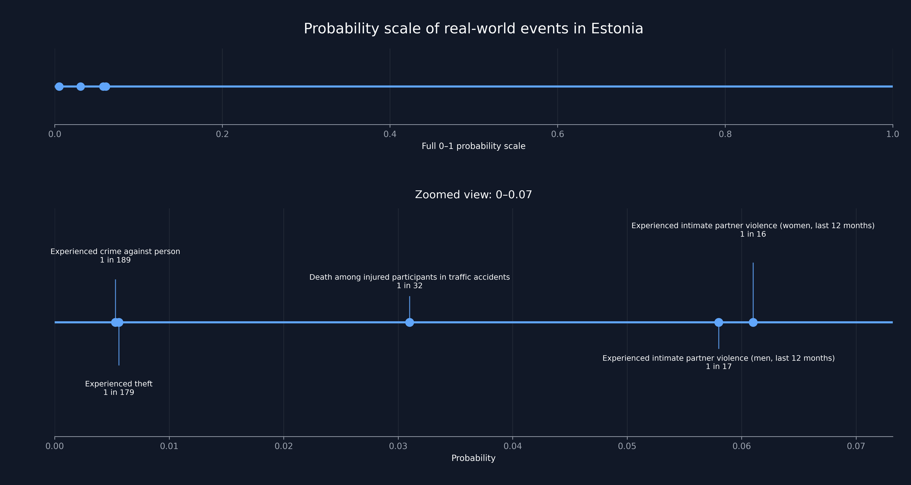

# Probability Scale of Real-World Events in Estonia



## Goal

The goal of this project is to build an intuitive probability scale of real-world events
based on publicly available data.

Instead of percentages, the results are presented as "1 in X" probabilities
to make them easier to understand for a general audience.

---

## Key idea

The project demonstrates that many real-world risks in Estonia are relatively low.

Most probabilities occupy only a very small portion of the full 0–1 scale,
indicating that events such as crime and fatal traffic accidents are statistically uncommon on a yearly basis.

However, the scale also highlights an important contrast:
among the selected events, the highest probability is associated with
intimate partner violence.

This shows that while overall risk levels are low,
it is concerning that intimate partner violence appears at the highest end of the scale.

The probability of experiencing intimate partner violence is approximately
10 times higher than that of being a victim of theft, based on the selected datasets.

---

## Visualization

Two views are used:

1. **Full 0–1 probability scale**  
   Shows how small most real-world probabilities are relative to certainty.

2. **Zoomed view (0–0.07)**  
   Focuses on the range where all events lie, making differences easier to see.


---

## Data sources

Data is collected from:

- Statistics Estonia API

- The crime dataset was downloaded from:  
https://www.kriminaalpoliitika.ee/kuritegevus2021/
(Since no structured API endpoint was available.)


---

## Data pipeline

Each dataset follows the same processing steps:

1. Fetch raw data (JSON or XLSX)
2. Parse into a structured DataFrame
3. Clean and normalize data
4. Select relevant subset
5. Convert to probabilities
6. Save processed dataset

---

## JSON-stat parsing

Statistics Estonia provides data in JSON-stat format, which is not directly usable.

A reusable parser was implemented to convert JSON-stat datasets
into table, supporting datasets with different numbers of dimensions.

---

## Probability calculation

All values are converted into:

- probability (0–1 scale)
- "1 in X" representation

---

## Important note on comparability

Not all probabilities represent the same type of risk:

- Violence and crime data represent **annual probabilities for individuals**
- Traffic data represents a **conditional probability** (given that an accident occurs)

---

## Dataset scope

The datasets used in this project are intentionally simplified.

While more detailed analysis is possible (e.g. regional or multi-year),
this project focuses on producing a clear and interpretable probability scale.

The pipeline itself is flexible and can be extended to include:

- multiple years
- county based comparisons (Harjumaa vs Läänemaa etc.)
- additional categories

---

## Reproducibility

The data processing pipeline dynamically selects the latest available year
instead of relying on hardcoded values.

This makes the project reusable: if new data is added to the source APIs,
the same code will continue to work without modification,
as long as the dataset structure remains consistent.

---

## How to run

1. Fetch raw data:
```bash
python scripts/run_fetching.py
```

2. Process datasets:
```bash
python run_violence_processing.py
python run_traffic_processing.py
python run_crime_processing.py
```

3. Build probability scale:
```bash
python scripts/run_build_scale.py
```


4. Generate visualization:
```bash
python scripts/run_make_plot.py
```
